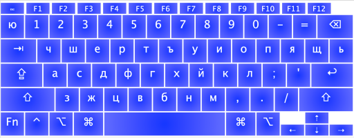
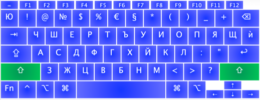
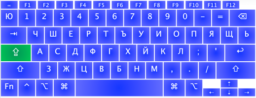
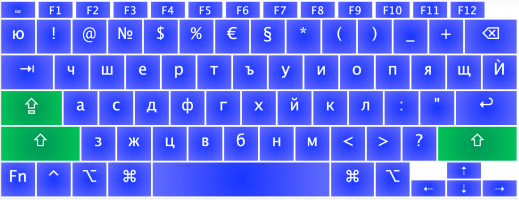
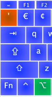
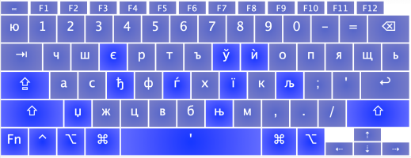

osx-new-phonetic (чшерти)
================
Българска - Фонетична клавиатура (прБДС2006 ) за Мак 
New (as of 2013) Bulgaria Phonetic keyboard layout for Mac OS X
----------------

Bulgarian Cyrillic Phonetic (BDS) keyboard layout similar to Winows 7 & Vista adapted for Mac OS X

Inspired by [BDS-bg.org PDF](https://bds-bg.org/images/upload/Novini/prBDS_5237(1).pdf) if curiouse about this standart check this [Wikipedia topic](https://bg.wikipedia.org/wiki/Фонетична_подредба#Проект_за_стандарт_прБДС_5237:2006_(нова_фонетична_подредба,_подредба_за_устройства_с_малко_клавиши,_и_променена_БДС_5237:1978))

## Install steps

### Step 1. Clone this repo OR download the two files:

```Bulgarian - New Phonetic.icns```

```Bulgarian - New Phonetic.keylayout```

### Step 2. Copy those TWO files 

#### Option 1: For System wide install (requires Admin permisions)

Copy files to ```/Library/Keyboard Layouts/```

#### Option 2: For Current logged users (will be available post login screen)
Copy files to ```~/Library/Keyboard Layouts/```
 
> Note: Keyboard layout in ~/Library/Keyboard Layouts/ can't be selected on **password dialogs** or on the **login screen**.

### Step 3. Restart the computer. 
> Note: Logging out and back in is not enough.

### Step 4. Enable the new keyboard layout from 
Open ```System Preferences``` and open ```Keyboard``` panel

### Step 5. Add new input source 
- Navigato to the tab called ```Input Sources``` 
- Then click the plus button ```+``` at bottom left corner 
- Then pick language ```Other```

## Keyboard Layouts

### No special keys pressed



### ```shift``` pressed



### ```caps lock``` active



### ```caps lock``` active and ```shift``` pressed



### Special character sequences

Press ``` option + ` ``` modifier



... followed by one of keys (in blue)



Enjoy!

_LICENSE: MIT_

Made using (Ukelele)[https://software.sil.org/ukelele/]

For iconset regeneration: ```iconutil -c icns icon.iconset```